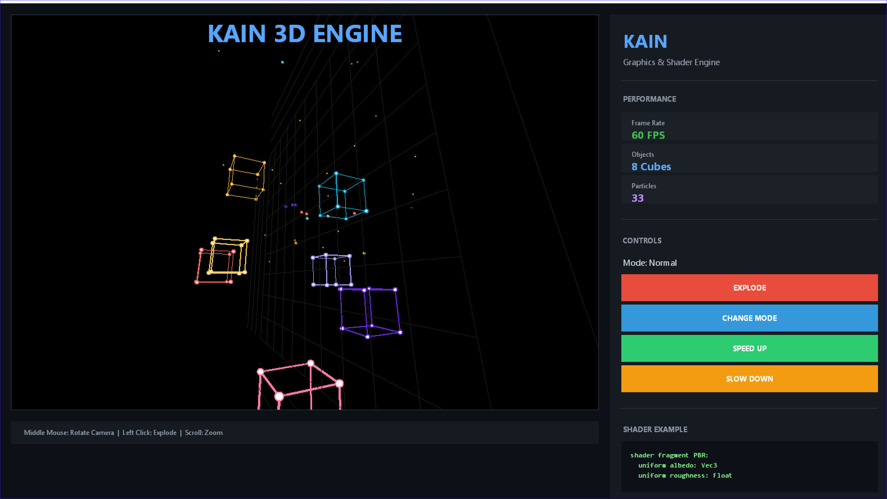

# KAIN Python FFI

Execute Python code directly from KAIN with the `py_exec` intrinsic. This enables real-time visualization, GUI applications, and integration with the entire Python ecosystem.



## Overview

The Python FFI allows KAIN programs to:
- Execute arbitrary Python code at runtime
- Leverage Python libraries for visualization (tkinter, matplotlib, pygame)
- Build interactive applications without compilation
- Prototype graphics and UI systems rapidly

## Quick Start

```bash
# Install KAIN
cargo install kain-lang

# Run the 3D engine demo
kain python_FFI/examples/3d_engine.kn -t run
```

## Hot Reload

Enable watch mode for instant feedback during development:

```bash
kain run python_FFI/examples/3d_engine.kn --watch
```

Changes to the source file trigger automatic re-execution.

## Usage

The `py_exec` function accepts a Python code string:

```kain
fn main():
    let code = "
import tkinter as tk

root = tk.Tk()
root.title('KAIN App')

canvas = tk.Canvas(root, width=800, height=600, bg='black')
canvas.pack()

# Draw graphics using Python
canvas.create_oval(100, 100, 200, 200, fill='cyan')

root.mainloop()
"
    py_exec(code)
```

## Examples

### 3D Particle Engine

`examples/3d_engine.kn` implements a complete 3D graphics engine featuring:

| Feature | Description |
|---------|-------------|
| **3D Projection** | Perspective camera with rotation |
| **Particle System** | Dynamic particle spawning and physics |
| **Interactive Controls** | Mouse-driven camera manipulation |
| **Multiple Render Modes** | Normal, Chaos, Rainbow, Pulse |
| **Explosion Effects** | Click-triggered particle bursts |

**Controls:**
- Middle Mouse: Rotate camera
- Left Click: Trigger explosion
- Scroll: Zoom in/out

## Directory Structure

```
python_FFI/
├── README.md
├── assets/
│   └── 3d_engine_preview.png
└── examples/
    └── 3d_engine.kn
```

## Architecture

```
┌─────────────────────────────────────────────────┐
│               KAIN Runtime                      │
│  ┌─────────────────────────────────────────┐   │
│  │   py_exec(code: String)                 │   │
│  │         │                               │   │
│  │         ▼                               │   │
│  │   ┌──────────────────────────────────┐  │   │
│  │   │   Embedded Python Interpreter    │  │   │
│  │   │   (via pyo3)                     │  │   │
│  │   └──────────────────────────────────┘  │   │
│  └─────────────────────────────────────────┘   │
└─────────────────────────────────────────────────┘
                      │
                      ▼
         ┌────────────────────────┐
         │   Python Libraries     │
         │   (tkinter, pygame,    │
         │    matplotlib, etc.)   │
         └────────────────────────┘
```

## Use Cases

- **Rapid Prototyping**: Test visual algorithms without compile cycles
- **Data Visualization**: Plot results using matplotlib or seaborn
- **GUI Applications**: Build desktop apps with tkinter or PyQt
- **Game Development**: Prototype game mechanics with pygame
- **Scientific Computing**: Integrate NumPy, SciPy workflows

## Requirements

- KAIN compiler v0.1.0 or later
- Python 3.8+ with tkinter (included in most distributions)
